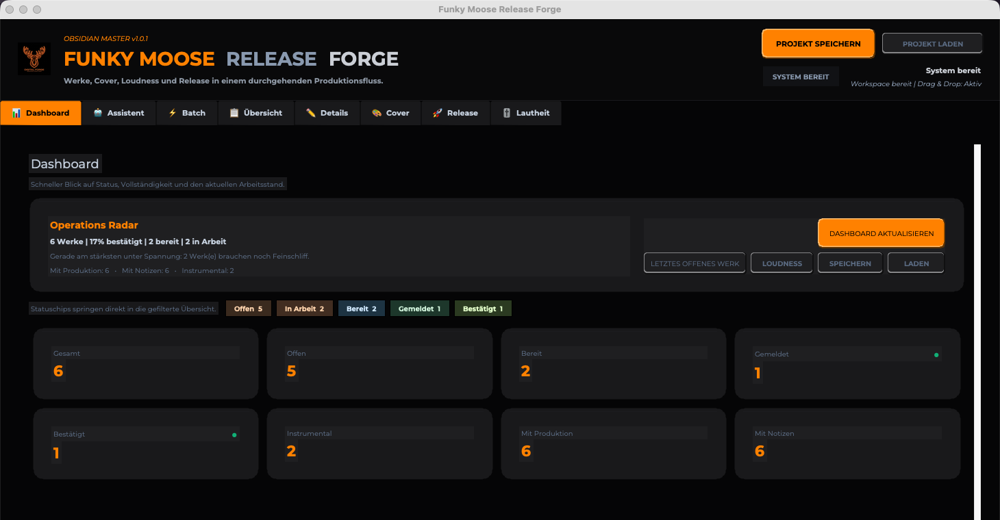

<p align="center">
  
</p>

# Funky Moose Release Forge
## The Release Forge for Humans Who Make Music

Less spreadsheet pain. More flow.  
Weniger Excel-Gewuerge. Mehr Flow.



*The dashboard keeps status, batch work, cover prep, loudness and release packaging in one place.  
Das Dashboard haelt Status, Batch, Cover, Loudness und Release-Paketierung an einem Ort zusammen.*

### Demo Video

[Watch the app walkthrough](assets/funky-moose-release-forge-demo.mp4)

**Funky Moose Release Forge** is a desktop app for artists, producers, songwriters and release-minded music people who want one strong place for metadata, cover work, loudness checks and release prep.

**Funky Moose Release Forge** ist eine Desktop-App fuer Artists, Produzent:innen, Songwriter:innen und alle Musikmenschen, die Metadaten, Cover-Arbeit, Loudness und Release-Vorbereitung an einem starken Ort buendeln wollen.

It is built for the real mess behind releases: titles, durations, notes, composer data, cover versions, loudness targets, export files, release assets and all the small details that otherwise get lost across folders, spreadsheets and half-finished lists.

Sie ist fuer das echte Chaos hinter Releases gebaut: Titel, Dauern, Notizen, Komponist:innen-Daten, Cover-Versionen, Loudness-Ziele, Export-Dateien, Release-Assets und all die kleinen Teile, die sonst in Ordnern, Tabellen und halbfertigen Listen verschwinden.

---

## What It Does

### English
Funky Moose Release Forge turns scattered release work into one focused desktop workflow.

It helps you:
- manage catalog and metadata in one place
- prepare collecting-society style workflows faster
- build and preview cover variations
- check LUFS and true peak
- assemble release assets and export packages
- keep track of status instead of guessing where you left off

### Deutsch
Funky Moose Release Forge verwandelt verstreute Release-Arbeit in einen fokussierten Desktop-Workflow.

Die App hilft dir dabei:
- Katalog und Metadaten an einem Ort zu verwalten
- AKM-/GEMA-nahe Workflows schneller vorzubereiten
- Cover-Varianten zu bauen und zu pruefen
- LUFS und True Peak zu kontrollieren
- Release-Assets und Export-Pakete zusammenzustellen
- den Ueberblick zu behalten, statt zu raetseln, wo du zuletzt aufgehoert hast

---

## Core Areas

### Catalog
Titles, works, durations, composers, notes, tags and status.  
No treasure hunt. No folder archaeology.

### Batch Flow
For the repetitive part of release prep.  
Copy flow, navigation, fast handling, less friction.

### Cover Forge
Preview artwork, manage assets, test text placement and prepare export-ready covers.

### Loudness
Check LUFS and true peak and prepare matched outputs without losing the thread.

### Release Workspace
Bring the pieces together and prepare the final package.

---

## Hauptbereiche

### Katalog
Titel, Werke, Dauern, Komponist:innen, Notizen, Tags und Status.  
Keine Schatzsuche. Keine Ordner-Archaeologie.

### Batch Flow
Fuer den wiederkehrenden Teil der Release-Vorbereitung.  
Copy-Flow, Navigation, schnelles Arbeiten, weniger Reibung.

### Cover Forge
Artworks pruefen, Assets verwalten, Textplatzierung testen und exportfertige Cover vorbereiten.

### Loudness
LUFS und True Peak kontrollieren und gematchte Dateien vorbereiten, ohne den Faden zu verlieren.

### Release Workspace
Alle Teile zusammenfuehren und das finale Paket vorbereiten.

---

## Built For

### English
- independent artists
- producers and composers
- small studios
- release-focused teams
- people who are tired of doing music admin with ten open folders and mild despair

### Deutsch
- unabhaengige Artists
- Produzent:innen und Komponist:innen
- kleine Studios
- release-orientierte Teams
- Menschen, die Musikverwaltung nicht mehr mit zehn offenen Ordnern und leichter Verzweiflung machen wollen

---

## Current Status

**Active development / usable beta**  
**Aktive Entwicklung / nutzbare Beta**

Current workflow areas inside the project include:
- catalog and metadata handling
- batch-oriented workflow
- cover workflow
- loudness workspace
- release preparation

Aktuell im Projekt enthalten sind:
- Katalog- und Metadatenverwaltung
- batch-orientierter Workflow
- Cover-Workflow
- Loudness-Bereich
- Release-Vorbereitung

---

## Quick Start

### Local run
```bash
pip install -r requirements.txt
python3 akm_app.py
```

### macOS build
```bash
python3 -m PyInstaller --clean --noconfirm 'FunkyMooseReleaseForge.spec'
```

The versioned PyInstaller spec is `FunkyMooseReleaseForge.spec`, and the built app is `Funky Moose Release Forge.app`.

### Release automation
- tests run on pushes and pull requests
- version tags in the format `v*` build macOS and Windows release packages
- tagged builds publish release ZIPs automatically via GitHub Actions

### See also
- [INSTALL_MAC.md](INSTALL_MAC.md)
- [INSTALL_WINDOWS.md](INSTALL_WINDOWS.md)

### Project Structure
- `akm_app.py` - main app entry and orchestration
- `app_controllers/` - controllers
- `app_logic/` - processing and business logic
- `app_ui/` - UI components
- `app_workflows/` - workflow modules
- `tests/` - tests
- `.github/workflows/` - CI and automation
- `assets/` - artwork, screenshots and demo material

---

## Why It Exists

### English
Because music admin should not feel like punishment.

Because release work gets messy fast.

Because good tools should help you stay in flow, not drag you into dead menus, broken lists and forgotten folders.

### Deutsch
Weil Musikverwaltung sich nicht wie Strafe anfuehlen sollte.

Weil Release-Arbeit schnell unuebersichtlich wird.

Weil gute Tools dich im Flow halten sollten, statt dich in tote Menues, kaputte Listen und vergessene Ordner zu ziehen.

---

## Funky Moose Spirit

This app is not built for corporate fog.  
It is built for real work, real releases and real creative momentum.

No fake magic.  
No empty dashboard theatre.  
Just a strong workflow forge for getting music from chaos to control.

Diese App ist nicht fuer Unternehmensnebel gebaut.  
Sie ist fuer echte Arbeit, echte Releases und echten kreativen Schwung gebaut.

Keine falsche Magie.  
Kein leeres Dashboard-Theater.  
Sondern eine starke Workflow-Forge, die Musik von Chaos zu Kontrolle bringt.

---

## License

No license file is included yet. Add your preferred license here when you are ready.
